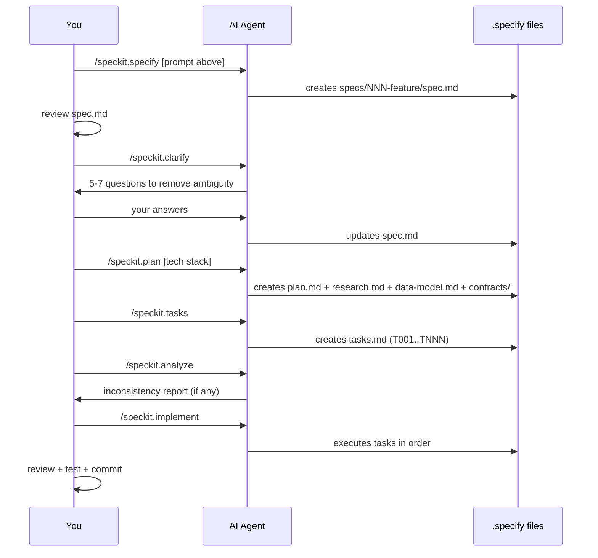

# Balanced Digital Children's Platform — Spec-Driven Development Roadmap

## 1. Phase 1 — Real Data Layer & APIs

**Goal:​** Replace all mock data with real content from Supabase, exposed via a unified API surface.

### `/speckit.specify`

```
Build the real content & API layer that replaces all mock data in the
child screens (stories, games, videos, creative) and exposes a
typed API surface used by both child and parent apps.

User Stories:
- As a child, when I open Stories, I see a curated list fetched from
  the database, filtered by my age group and parent-approved categories.
- As a parent, when I add/remove an allowed category, the child's
  available content updates on next session start.
- As a developer, every read/write goes through one services/api
  module — no direct supabase calls scattered in screens.

Scope includes:
- Schema: stories, games, videos, creative_activities,
  child_profiles, parent_profiles, allowed_categories, sessions,
  activity_logs.
- Row-Level Security policies (parent reads own children only;
  child reads only allowed content).
- Typed API client wrapping Supabase (services/api/*.ts).
- Seed data: at least 20 stories, 10 games, 15 videos, 8 activities.
- Migration of existing screens (index.tsx, stories, games, videos,
  creative) from mock arrays to API hooks.

Out of scope: Realtime push (next feature), reports charts (feature 3).
```

### `/speckit.plan` (after `/speckit.clarify`)

```
Tech stack: Supabase (Postgres + RLS) for backend, @supabase/supabase-js
v2 client, Zustand for cache layer, React Query (TanStack) for
server state. Place all API modules in services/api/{stories,games,
videos,creative,profiles}.ts. Each exports typed functions:
list(filters), getById(id), logActivity(payload). Generate TypeScript
types from Supabase schema using `supabase gen types`.
```

### Expected Outputs
- `services/api/*.ts` complete
- `server/migrations/*.sql` for Postgres tables + RLS
- `server/seeds/*.sql` with seed data
- All `mockStories`, `mockGames`, etc. replaced by hooks like `useStories()`

---

## 2. Phase 2 — Realtime Sync & Parent Commands

**Goal:​** Enable a live bi-directional channel between parent and child devices — the most critical feature in the project.

### `/speckit.specify`

```
Implement bi-directional real-time control channel between parent
device and child device using Supabase Realtime channels.

User Stories:
- As a parent, when I tap "Pause Now", the child's screen freezes
  with a friendly mascot message within 2 seconds.
- As a parent, when I reduce daily screen time mid-session, the
  child's remaining-time indicator updates immediately and the
  session ends at the new limit.
- As a parent, when I block a category, any active content in that
  category exits gracefully (no abrupt crash) and shows the
  "go play outside" Lottie animation.
- As a child, when network drops, my session continues offline with
  last-known limits; on reconnect, missed parent commands apply in
  order with no duplicates.

Functional requirements:
- Channel naming: `family:<family_id>` with separate broadcast
  events: `pause`, `resume`, `time_update`, `category_block`,
  `force_end`.
- Idempotent command IDs (UUID) so the child applies each command
  only once even after reconnection replay.
- Heartbeat every 30s; if parent receives no heartbeat for 90s,
  show "Child device offline" indicator.
- Logged in activity_logs table for audit.
```

### Critical Outputs
- `services/realtime/familyChannel.ts`
- `store/useSessionStore.ts` supporting idempotent `applyCommand(cmd)`
- Integration tests: simulate "parent changes time → child responds"

---

## 3. Phase 3 — Live Reports & Charts

**Goal:​** Transform `reports.tsx` from static visuals into a data-driven dashboard.

### `/speckit.specify`

```
Wire the parent reports screen to live aggregated data with
filterable time ranges and category breakdowns.

User Stories:
- As a parent, I select Today/Week/Month and see total screen time,
  category distribution (stories/games/videos/creative), and most-
  used activities.
- As a parent, I can compare two children side-by-side if I have
  multiple child profiles.
- As a parent, I export a weekly summary as PDF or share via system
  share sheet.

Aggregation rules:
- Pre-computed daily rollups via a Supabase scheduled function
  (pg_cron) writing to daily_stats table — keeps reads fast.
- Real-time partial update for "today" only; historical days are
  immutable.
```

### Tech Plan
- `Victory Native` or `react-native-svg-charts` for visualizations
- Postgres function `aggregate_daily_stats(child_id, day)` scheduled via pg_cron
- `services/api/reports.ts` with 60s caching

---

## 4. Phase 4 — Resilience & Real-Device Testing

**Goal:​** Handle all edge cases and validate on physical devices.

### `/speckit.specify`

```
Harden the application against real-world conditions and validate
on physical iOS and Android devices.

Edge cases to handle:
- No internet on app launch → child sees cached content + offline
  badge; parent sees "last synced 3 min ago".
- App killed by OS during child session → on reopen, resume timer
  from where it left (not reset).
- Parent forgets PIN → recovery via email link + security question
  set during onboarding.
- Child tries to bypass time limit by changing device clock →
  use server time as source of truth.
- Lottie/heavy animation lag on low-end Android → degrade to static
  image if FPS < 30 for 2s.
- Battery saver mode → reduce realtime reconnect attempts.

Quality gates:
- E2E tests with Maestro: parent-onboarding, child-session-end,
  pin-gate-bypass-attempt.
- Manual test matrix: iPhone SE (small screen), iPad (tablet),
  Pixel 4a, Galaxy A series.
- Accessibility audit: VoiceOver + TalkBack on 5 key screens.
- Performance: cold start < 3s on mid-tier device.
```

---

## 5. Phase 5 — Production Release

**Goal:​** Ship to App Store and Google Play.

### `/speckit.specify`

```
Prepare the application for public release on iOS App Store and
Google Play, including production builds, store assets, privacy
compliance, and monitoring.

Deliverables:
- EAS Build profiles: development, preview, production (iOS + Android).
- Environment separation: .env.production with production Supabase
  project + separate database.
- Privacy: GDPR/COPPA-compliant privacy policy page (kids' app
  category requires extra disclosures), data deletion endpoint.
- Store listing assets: 6 screenshots per device class, app icon,
  feature graphic, Arabic + English descriptions.
- Crash reporting: Sentry integration, source maps uploaded.
- Analytics (privacy-respecting): PostHog or self-hosted, no
  third-party trackers in child screens.
- Versioning: semantic releases via EAS Submit.

Release checklist:
- App Review compliance: kids category (Apple) + Designed for
  Families (Google) requirements explicitly addressed.
- Beta via TestFlight + Internal Testing track for 2 weeks.
```

---

## 6. Practical Workflow for Each Phase (Cycle)

For each of the 5 phases above, run this cycle inside your AI agent:

